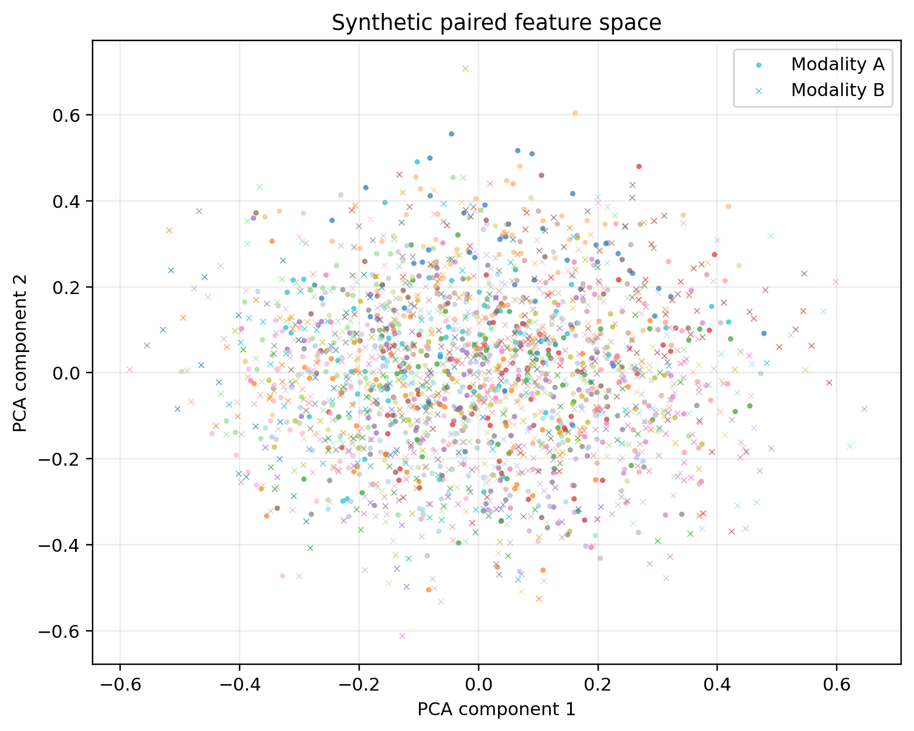
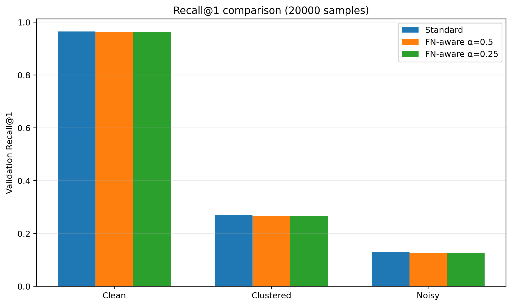
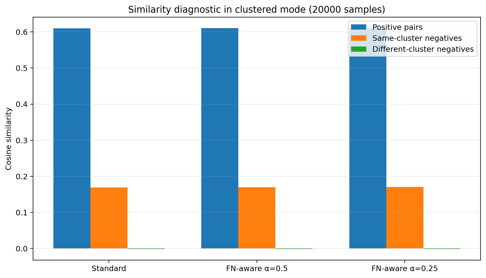

# False-Negative-Aware Contrastive Learning

A controlled experiment on how false negatives affect contrastive retrieval.

This repository compares **standard InfoNCE** with a **false-negative-aware InfoNCE variant** using synthetic paired data with known semantic cluster structure. The goal is to study loss-function behavior under clean, clustered, and noisy-pair conditions.

---

## Problem

Contrastive learning usually assumes that every non-matching sample in a batch is a negative.

That assumption is not always safe.

In real multimodal datasets, two samples may not be exact pairs, but they can still be semantically similar. If contrastive learning pushes those samples apart too strongly, the model may learn a representation that is overly strict or semantically distorted.

This repository studies that problem in a controlled setup.

---

## Core Question

**Can false-negative-aware InfoNCE improve retrieval when semantically similar samples are incorrectly treated as negatives?**

The project tests this question by controlling:

- semantic cluster overlap
- corrupted positive pairings
- sample size
- false-negative downweighting strength

---

## Hypothesis

False-negative-aware contrastive learning should help most when the dataset contains many semantically similar non-paired samples.

However, the benefit may disappear when:

- the data is already clean
- positive pairs are corrupted
- same-cluster negatives are downweighted too strongly
- standard InfoNCE is already sufficient

---

## Methods

### Standard InfoNCE

Standard InfoNCE pulls matched pairs together and pushes all other batch samples apart.

In this setup, every non-matching sample is treated as a negative.

### False-Negative-Aware InfoNCE

The false-negative-aware variant uses synthetic semantic cluster labels.

If two samples are not exact pairs but belong to the same cluster, their negative contribution is reduced.

Two downweighting strengths are tested:

| Loss | Meaning |
|---|---|
| FN-aware alpha 0.5 | Moderate downweighting of same-cluster negatives |
| FN-aware alpha 0.25 | Stronger downweighting of same-cluster negatives |

---

## Related Work

This repository is inspired by contrastive representation learning and work on false negatives in contrastive objectives.

The baseline loss is based on **InfoNCE**, popularized in *Representation Learning with Contrastive Predictive Coding* by van den Oord et al. InfoNCE learns representations by pulling positive pairs together while pushing sampled negatives apart.

However, randomly sampled negatives can include semantically similar examples. This creates false-negative pressure.

**Debiased Contrastive Learning** by Chuang et al. studies this negative-sampling bias and proposes a debiased objective for cases where same-label or semantically similar samples may be sampled as negatives.

**False Negative Cancellation** by Huynh et al. directly studies how false negatives can harm contrastive self-supervised learning and proposes ways to reduce their effect.

**Supervised Contrastive Learning** by Khosla et al. is also relevant because it treats same-class samples as positives rather than negatives, which connects to the semantic-cluster setup used here.

This repository does not reproduce those papers directly. Instead, it builds a controlled benchmark to compare standard InfoNCE with a simple false-negative-aware variant.

### Why these references?

- **CPC / InfoNCE** provides the foundation for the contrastive objective used in this repository.
- **Debiased Contrastive Learning** is directly related to negative-sampling bias and false negatives.
- **False Negative Cancellation** focuses on identifying and reducing harmful false negatives.
- **Supervised Contrastive Learning** provides useful background for treating same-class or same-cluster samples differently from ordinary negatives.

---

## Synthetic Benchmark Design

The dataset contains paired synthetic feature vectors:

| Component | Description |
|---|---|
| Modality A | Synthetic feature vector |
| Modality B | Paired synthetic feature vector |
| Cluster label | Known semantic group |
| Pair label | Matching pair identity |

Three dataset modes are tested:

| Mode | Purpose |
|---|---|
| Clean | Correct pairs with low false-negative pressure |
| Clustered | Many semantically similar samples, increasing false-negative risk |
| Noisy | Some positive pair assignments are intentionally corrupted |

The benchmark uses synthetic paired features so that the false-negative structure, cluster overlap, pair corruption, and sample size can be explicitly controlled.

---

## Experiment Matrix

| Variable | Values |
|---|---|
| Loss function | Standard InfoNCE, FN-aware InfoNCE |
| Alpha | 0.5, 0.25 |
| Dataset mode | Clean, clustered, noisy |
| Sample size | 5000, 20000 |
| Epochs | 50 |

Total benchmark runs:

```text
3 dataset modes × 2 sample sizes × 3 loss settings = 18 runs
```

---

## Metrics

The experiments report:

| Metric | Meaning |
|---|---|
| Recall@1 | Correct match is ranked first |
| Recall@5 | Correct match appears in top 5 |
| Recall@10 | Correct match appears in top 10 |
| Recall@50 | Correct match appears in top 50 |
| Lift@K | Improvement over random retrieval |
| Positive similarity | Average similarity of true pairs |
| Same-cluster negative similarity | Similarity between semantically similar non-pairs |
| Different-cluster negative similarity | Similarity between different-cluster non-pairs |
| Training loss | Optimization objective value |

---

## False-Negative Visualization

The plots below summarize the synthetic feature space and the main false-negative-aware comparison.

<table>
  <tr>
    <th>Input feature space</th>
    <th>Recall comparison</th>
    <th>Similarity diagnostic</th>
  </tr>
  <tr>
    <td width="33%">
      <a href="figures/fn_aware_input_feature_space.png">
        
      </a>
    </td>
    <td width="33%">
      <a href="figures/fn_aware_recall_comparison.png">
        
      </a>
    </td>
    <td width="33%">
      <a href="figures/fn_aware_similarity_diagnostic.png">
        
      </a>
    </td>
  </tr>
</table>

Each panel links to the full-resolution figure.

| Panel | What to notice |
|---|---|
| **Input feature space** | Circles and crosses represent the two paired modalities. Colors indicate synthetic semantic clusters. Same-colored non-paired samples are potential false negatives under standard InfoNCE. |
| **Recall comparison** | Standard InfoNCE and FN-aware variants are compared across clean, clustered, and noisy settings. This shows whether downweighting same-cluster negatives improves retrieval. |
| **Similarity diagnostic** | Positive-pair similarity is compared with same-cluster negative similarity and different-cluster negative similarity. This helps show whether the model separates true negatives while avoiding excessive punishment of semantically related samples. |

These figures are qualitative diagnostics. The main conclusions are based on the quantitative retrieval results in `experiments/results_table.csv`.

---

## Main Findings

The results show that false-negative-aware InfoNCE is **not universally better** than standard InfoNCE.

Instead, its usefulness depends on the data condition.

### Clean data

Standard InfoNCE already performs almost perfectly. FN-aware loss does not improve retrieval because there is little false-negative pressure to fix.

### Clustered data

FN-aware loss improves some top-rank retrieval metrics in the 5000-sample clustered setup. This supports the idea that downweighting same-cluster negatives can help when semantically similar samples are incorrectly treated as hard negatives.

At 20000 samples, the results are mixed. Standard InfoNCE remains strong, while FN-aware loss improves some mid/top-k metrics depending on alpha.

### Noisy data

When positive pairs are corrupted, all losses degrade.

FN-aware loss slightly improves some retrieval metrics, but it cannot fully repair wrong positive supervision.

---

## Key Takeaway

False-negative-aware contrastive learning can help when semantic overlap creates harmful negatives, but it is not a universal replacement for standard InfoNCE.

The main lesson is:

> Loss design, semantic cluster structure, positive-pair quality, alpha strength, and sample size must be evaluated together.

---

## Repository Structure

```text
fn-aware-contrastive-learning/
│
├── src/
│   ├── make_demo_data.py
│   ├── train.py
│   ├── losses.py
│   ├── model.py
│   ├── metrics.py
│   └── collect_results.py
│
├── data_demo/
│   ├── demo_pairs.csv
│   └── demo_metadata.json
│
├── experiments/
│   ├── results_table.csv
│   └── results_summary.md
│
├── docs/
│   ├── method_overview.md
│   ├── experiment_design.md
│   ├── loss_explanation.md
│   ├── metric_explanation.md
│   └── reproducibility_notes.md
│
├── requirements.txt
└── README.md
```

---

## Quick Start

Install dependencies:

```powershell
pip install -r requirements.txt
```

Generate clustered synthetic data:

```powershell
python src/make_demo_data.py --mode clustered --n-samples 5000 --n-clusters 50
```

Train standard InfoNCE:

```powershell
python src/train.py --loss standard --epochs 50 --batch-size 512 --output-dir outputs/clustered_standard --checkpoint-dir checkpoints/clustered_standard
```

Train false-negative-aware InfoNCE:

```powershell
python src/train.py --loss fn_aware --alpha 0.5 --epochs 50 --batch-size 512 --output-dir outputs/clustered_fn_aware --checkpoint-dir checkpoints/clustered_fn_aware
```

Collect final metrics:

```powershell
python src/collect_results.py
```

---

## Results

- [Full controlled experiment summary](experiments/results_summary.md)
- [Result table](experiments/results_table.csv)

---

## Documentation

- [Method overview](docs/method_overview.md)
- [Experiment design](docs/experiment_design.md)
- [Loss explanation](docs/loss_explanation.md)
- [Metric explanation](docs/metric_explanation.md)
- [Reproducibility notes](docs/reproducibility_notes.md)

---

## References

- Aaron van den Oord, Yazhe Li, and Oriol Vinyals. *Representation Learning with Contrastive Predictive Coding*. arXiv, 2018.
- Ching-Yao Chuang, Joshua Robinson, Yen-Chen Lin, Antonio Torralba, and Stefanie Jegelka. *Debiased Contrastive Learning*. NeurIPS, 2020.
- Tri Huynh, Simon Kornblith, Matthew R. Walter, Michael Maire, and Maryam Khademi. *Boosting Contrastive Self-Supervised Learning with False Negative Cancellation*. WACV, 2022.
- Prannay Khosla, Piotr Teterwak, Chen Wang, Aaron Sarna, Yonglong Tian, Phillip Isola, Aaron Maschinot, Ce Liu, and Dilip Krishnan. *Supervised Contrastive Learning*. NeurIPS, 2020.

---

## Limitations

This repository is a controlled loss-function study using synthetic paired features and semantic cluster labels. The setup is designed to isolate the false-negative problem in contrastive learning under known conditions.

The results should be read as method-behavior analysis, not as evidence of performance on real clinical data or production retrieval systems.

Future work could extend this benchmark with repeated random seeds, additional alpha values, harder cluster-overlap settings, and evaluation on authorized real-world paired datasets.